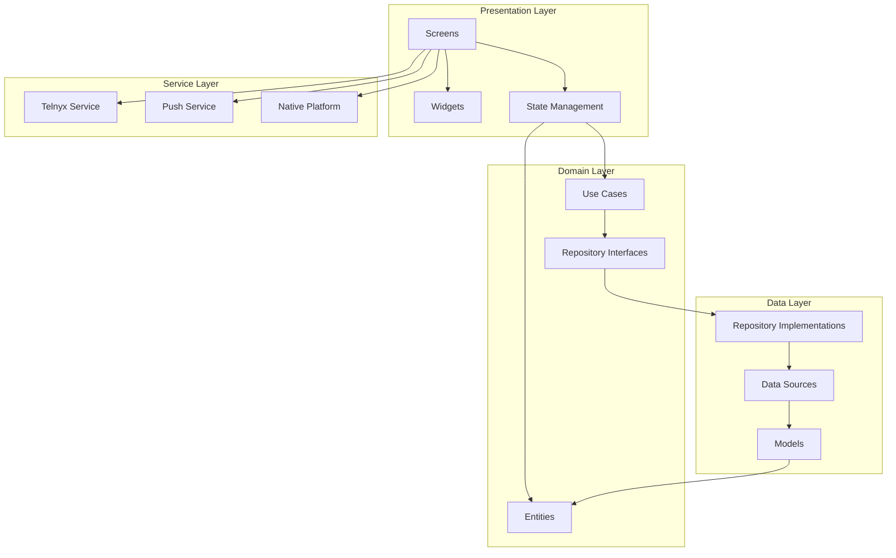

# Flutter Application Architecture

## Layer Architecture
```
lib/
├── core/                      # Core functionality
│   ├── constants/            # App constants
│   │   ├── api_endpoints.dart
│   │   ├── app_colors.dart
│   │   └── app_strings.dart
│   ├── errors/               # Error handling
│   │   ├── exceptions.dart
│   │   └── failures.dart
│   ├── network/              # Network configuration
│   │   ├── api_client.dart
│   │   └── network_info.dart
│   └── utils/                # Utilities
│       ├── validators.dart
│       └── formatters.dart
│
├── data/                      # Data layer
│   ├── datasources/          # Remote and local data sources
│   │   ├── remote/
│   │   │   ├── auth_remote_datasource.dart
│   │   │   ├── call_remote_datasource.dart
│   │   │   └── ai_remote_datasource.dart
│   │   └── local/
│   │       ├── auth_local_datasource.dart
│   │       └── cache_datasource.dart
│   ├── models/               # Data models
│   │   ├── user_model.dart
│   │   ├── call_model.dart
│   │   └── ai_config_model.dart
│   └── repositories/         # Repository implementations
│       ├── auth_repository_impl.dart
│       ├── call_repository_impl.dart
│       └── ai_repository_impl.dart
│
├── domain/                    # Business logic
│   ├── entities/             # Business entities
│   │   ├── user.dart
│   │   ├── call.dart
│   │   └── ai_agent.dart
│   ├── repositories/         # Repository contracts
│   │   ├── auth_repository.dart
│   │   ├── call_repository.dart
│   │   └── ai_repository.dart
│   └── usecases/            # Business use cases
│       ├── auth/
│       │   ├── login_usecase.dart
│       │   └── logout_usecase.dart
│       ├── call/
│       │   ├── make_call_usecase.dart
│       │   └── answer_call_usecase.dart
│       └── ai/
│           └── configure_ai_usecase.dart
│
├── presentation/              # Presentation layer
│   ├── providers/            # State management (Riverpod/Bloc)
│   │   ├── auth_provider.dart
│   │   ├── call_provider.dart
│   │   └── theme_provider.dart
│   ├── screens/              # Screen widgets
│   │   ├── auth/
│   │   │   ├── login_screen.dart
│   │   │   └── register_screen.dart
│   │   ├── call/
│   │   │   ├── incoming_call_screen.dart
│   │   │   └── active_call_screen.dart
│   │   └── home/
│   │       └── home_screen.dart
│   ├── widgets/              # Reusable widgets
│   │   ├── common/
│   │   ├── call/
│   │   └── forms/
│   └── router/               # Navigation
│       └── app_router.dart
│
├── services/                  # Platform services
│   ├── telephony/
│   │   ├── telnyx_service.dart
│   │   └── webrtc_handler.dart
│   ├── notification/
│   │   └── notification_service.dart
│   └── native/
│       ├── android_call_service.dart
│       └── ios_callkit_service.dart
│
└── main.dart                  # App entry point
```

## Component Interaction Diagram



