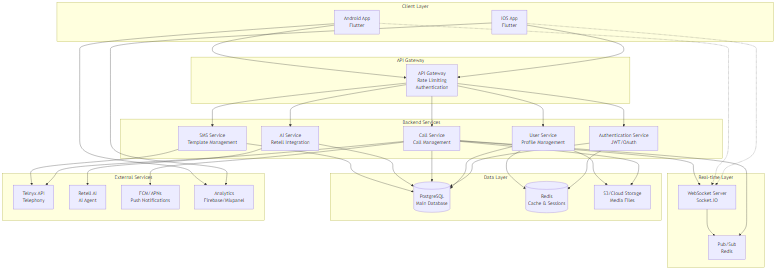
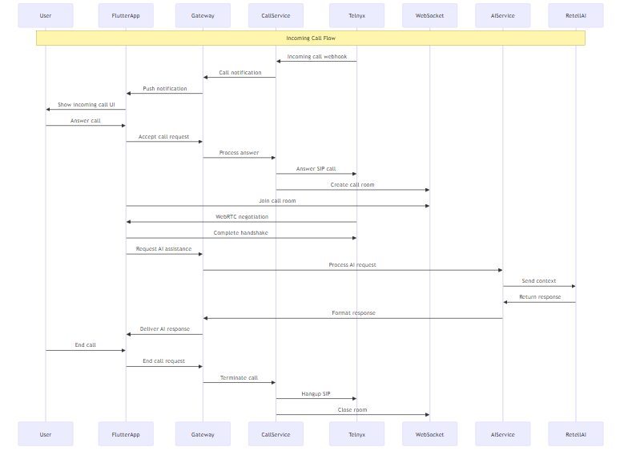
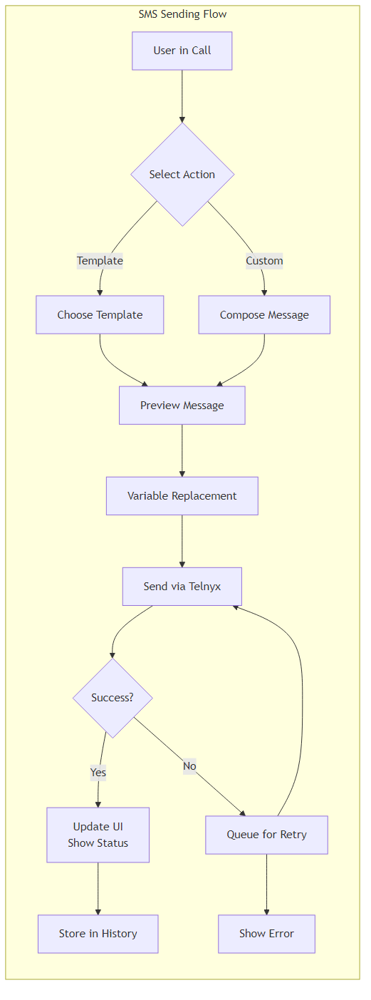
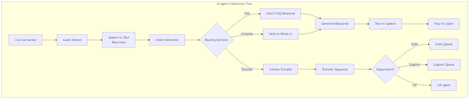

# ConnexUS System Architecture

## Table of Contents
1. [Overview](#overview)
2. [System Architecture](#system-architecture)
3. [Component Architecture](#component-architecture)
4. [Data Flow](#data-flow)
5. [API Design](#api-design)
6. [Security Architecture](#security-architecture)
7. [Deployment Architecture](#deployment-architecture)
8. [Technology Stack](#technology-stack)

## Overview

ConnexUS is a Flutter-based mobile application that provides AI-powered call management through integration with Telnyx telephony services and Retell AI. This document outlines the complete system architecture.

### Key Architectural Decisions
- **Architecture Pattern**: Clean Architecture with separation of concerns
- **Communication**: RESTful APIs with WebSocket for real-time features
- **State Management**: Riverpod or Bloc for Flutter state management
- **Database**: PostgreSQL for persistent storage, Redis for caching
- **Telephony**: Voice API + WebSocket + WebRTC (per ADR-001)

## System Architecture

### High-Level Overview


The system follows a service-oriented architecture with the following layers:
1. **Client Layer**: Native mobile applications built with Flutter
2. **API Gateway**: Central entry point for all client requests
3. **Service Layer**: Services handling specific business domains
4. **Real-time Layer**: WebSocket server and pub/sub backbone
5. **Data Layer**: Persistent storage and caching
6. **External Services**: Third-party integrations

### Service Descriptions

#### Authentication Service
- Handles user registration, login, and session management
- JWT-based authentication with refresh tokens

#### Call Service
- Manages call lifecycle (initiate, answer, end, transfer)
- WebRTC signaling and connection coordination
- Call history and recording metadata

#### AI Service
- Integration with Retell AI
- Knowledge base and FAQ management
- Response generation and routing decisions

#### User Service
- Profile management and preferences
- Phone number management

#### SMS Service
- Template management and variable substitution
- SMS sending via Telnyx and delivery tracking

## Component Architecture

See [Flutter Architecture](components/flutter-architecture.md) for detailed component structure.

## Data Flow

### Call Flow


### SMS Flow


### AI Interaction Flow


## API Design

### RESTful Endpoints
The complete API specification is available in [`docs/api/api-specification.yaml`](../api/api-specification.yaml)

### WebSocket Events (example)
```javascript
// Client -> Server Events
// 'join-call': { callId: string }
// 'leave-call': { callId: string }
// 'mute': { callId: string, muted: boolean }
// 'dtmf': { callId: string, tone: string }

// Server -> Client Events
// 'call-updated': { callId: string, status: string }
// 'participant-joined': { callId: string, userId: string }
// 'participant-left': { callId: string, userId: string }
```

## Security Architecture
- JWT-based authentication with refresh token rotation
- Role-based access control (future)
- Secure storage of tokens on device (Keychain/Keystore)
- Signed webhooks from Telnyx (verify signatures)

## Deployment Architecture
- API Gateway and services: containerized (Docker) with orchestration
- Database: managed PostgreSQL
- Cache: managed Redis
- Storage: S3-compatible object storage

## Technology Stack
- Flutter (Dart) for mobile apps
- Node.js/TypeScript or Go for backend services (to be decided in Task 9)
- PostgreSQL, Redis, S3
- Telnyx Voice API/WebRTC, Retell AI


